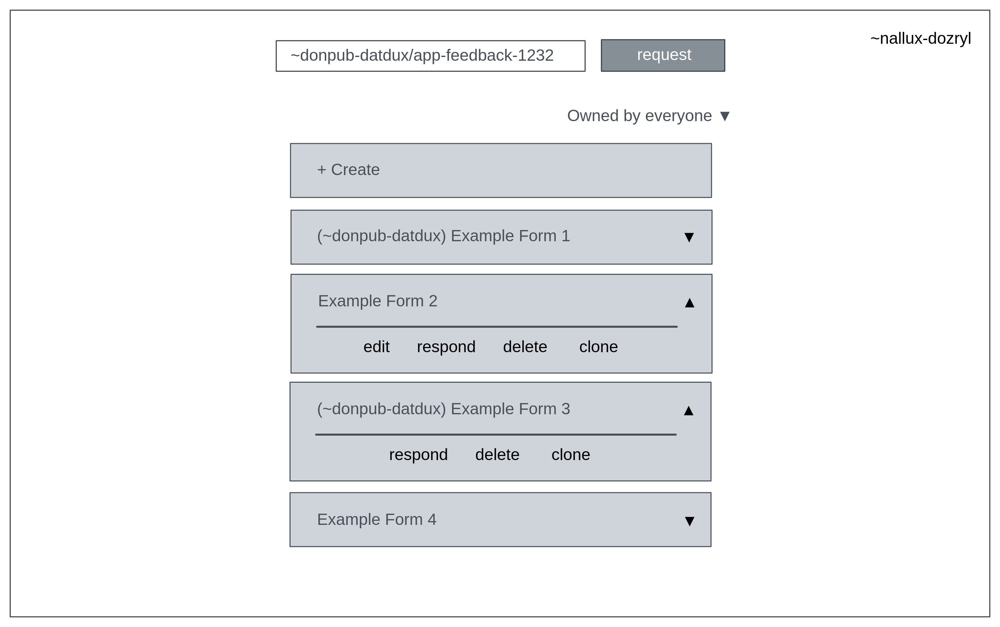
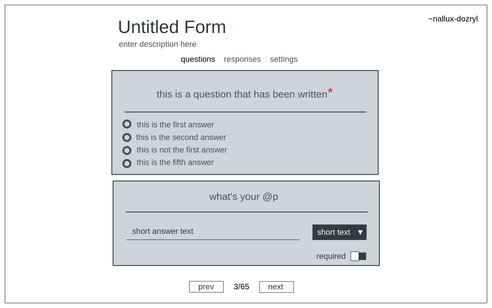
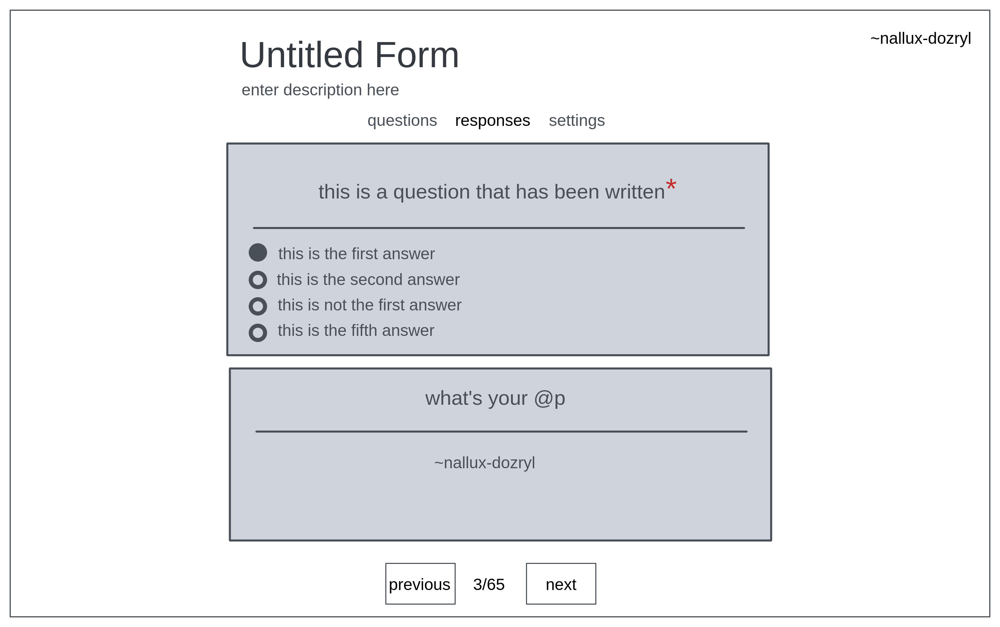
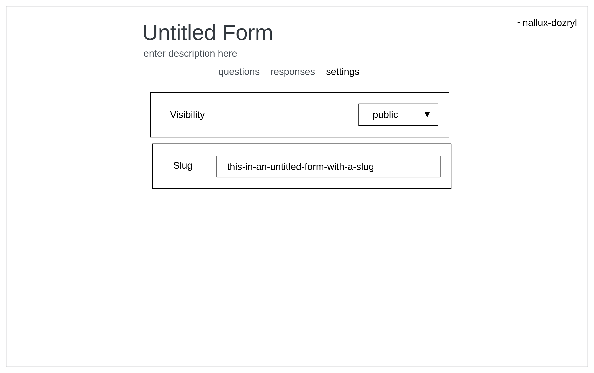
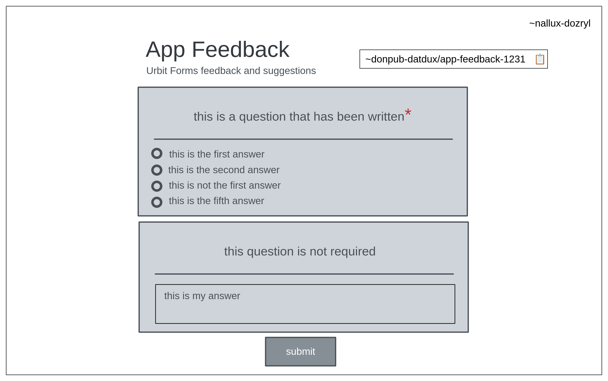

# Urbit Forms
Create forms and surveys with multiple question types.

## Introduction
This document will be split into 2 parts. The agent, which is the hoon code and
 the view, the glob for displaying the app.  

I have made the decision to work mostly in json, including the state, as this is the easiest
 way to keep the front end and back end as similar as possible. 

In its state, there are no separation between your own surveys and surveys you have received from
 other people. Instead, we put the author of the survey along side the survey itself. This also
 applies to responses.

## Agent

### Types
On the top level:
- `surveys`: the survey store, all forms goes here.
- `responses`: the response store, all responses goes here.

#### $surveys
This is a map of `author=ship` and a mop of `survey-id` and `survey` sorted by
 `gth`.
```
+$  surveys  (map author ((mop survey-id survey) gth))
```  

#### $responses
This is a mop of `survey-id` and a map of `author` and mop of `response-id` and `response`
 sorted by `gth` sorted by `lth`. *sorry for this description*
```
+$  responses  ((mop survey-id (map author ((mop response-id response) gth))) lth)
```

#### $survey
A survey is a json object containing:
- `title`: `@t -> %s`
- `description`: `@t -> %s`
- `visibility`: `?(%public %private %team) -> %s`
- `slug`: `@ta -> %s`
- `questions`: `((mop question-id question) gth) -> %o`

_**Note:**_ As of right now, %team doesn't do anything. This is for future functionality.

#### $response
A response is a json object containing a mop of `question-id` and `answer` sorted by gth
```
((mop question-id answer) gth) -> %o
```

#### $question
A question is a json object containing:
- `title`: this is the question itself `@t -> %s`
- `options`: these are the choices provided `set -> %a of %s`. If no
 options are required, (text etc), options will be omitted.
- `front`: the component type that gets rendered in the view `@tas -> %s`
- `back`: the type of value the agent accepts for this question `@tas -> %s`
- `required`: whether or not this question is a required question `? -> %b`

#### $answer
An answer is a json object with the back type as the key and the written answer
 as the value.
```
eg. [%o p={[p='noun' q=[%s p='this is my answer']]}]
```

### Actions
All possible actions the agent accepts.

```
+$  action
  $%  [%create title description visibility slug]
      [%delete survey-id]
      [%edit edit]
      [%ask ship survey-id]
      [%respond survey-id question-id answer]
      [%submit ship survey-id response]
  ==
```

#### %create
Creates a new survey.

#### %delete
Deletes a survey from your state.

#### %edit
Edits modifies the state of a survey. Adding, removing or editing
 questions are also part of this same action.

```
+$  edit
  $%  [%title survey-id title]
      [%desc survey-id description]
      [%vis survey-id visibility]
      [%question survey-id q-action]
  ==
```
q-action is defined as follows:
```
+$  q-action
  $%  [%add title options front back required]
      [%del question-id]
      [%mod question-id title options front back required]
  ==
```
_**Note:**_ Modifying a question will delete the question and recreate
 the question. I'm implementing it this way for simplicity. Open for
 comments.

#### %ask
Pokes the author ship to get a survey.

#### %respond
This puts an answer in the response and thus building the final response that will be sent
 to the survey author via %submit

### Updates
Updates are pretty straightforward in this agent. You either send out a `survey` or a `result`.
```
+$  update
  $%  [%survey survey-id survey]
      [%result survey-id result]
  ==
```
_**Note:**_ Result is a noun, this will be used when validation is a thing. Until then, it's just a placeholder.

### Scry Endpoints

#### Survey
1. `/x/surveys/all` - Retrieves all `survey`s in `$surveys`.
2. `/x/surveys/[ship]` - Retrieves all `survey`s authored by the selected ship.
3. `/x/survey/[survey-id]` - Retrieves a specific survey

#### Response
1. `/x/responses/[survey-id]` - Retrieves all responses for a specific form.
2. `/x/responses/[survey-id]/[ship]` - Retrieves all responses from a specific ship for a specific form.

## View

The term `form` and `survey` will be used interchangably below. This is because the agent uses
`survey` but the term `form` is more commonly used in the real world.

### Home Page

When opening the app, you will be greeted by the homepage. On the topmost of the page,
 there is a search bar. This is for requesting a survey from another ship. Below that,
 is the `+ Create` button. After that, a list of all the surveys in your survey
 store. Each item displays the title of the survey as well as a dropdown arrow. Clicking
 on the item itself will open the survey for responding.  

By clicking on the arrow, you will be presented with edit, respond, delete and clone. If you
 do not own the survey, you will not be able to edit it.



### New Form

After clicking on the `+ Create` button in the home page, you will be directed to this page.
 The title and description of the survey will by default `Untitled Form` and
 `enter description here` respectively. This can be changed.

Next, there are three tabs displayed. The first is this page, `questions`. Then there is
 `responses` and `settings`.

If there are no questions, only the buttons at the bottom of the screen will show. `+` is for
 adding a new question, and the floppy disk icon is the save button. Clicking this will update
 the state of your agent.



### Responses

Here, we see a similar layout to `New Form`, except the questions do not have options you can
 change. At the bottom of the screen, there are two buttons indicating `previous` and `next`
 with numbers showing the current and total reponses in between them. These buttons allow you to
 cycle between the different responses that have been submitted to you.



### Settings

This is the settings menu. You get to switch the visibility of the survey and modify the slug of
 the survey.



### Responding

This is the page you see when you click on any of the surveys in the home page. You will be
 presented with the title and description of the survey, with the address of the survey next
 to it.

Below all that are the questions itself. At the bottom of the survey, there is a submit button.
 Clickng on `submit` will send your response to the author of the survey.



## Deliverables and Funding

### Milestone 1 - 1 Star
- Completion: 11 June 2022 (1 month)
- The agent should be able to
  - Send, receive, edit and delete surveys.
  - Submit, receive and delete responses.
- A working front-end with the features outlined in the screenshots above.
- 9 front end question types
  - short text
  - paragraph
  - multiple choice (select one)
  - multiple choice (select many)
  - linear scale (discrete)
  - linear scale (continuous)
  - multiple choice grid (select one)
  - multiple choice grid (select many)
  - datetime

### Milestone 2 - 1 Star
- Completion: 11 July 2022 (1 month)
- Improved front-end
- CSV export
- Validation
- Multiple editors in one survey
- Anonymous survey -- Earth facing mirror

## Miscellaneous

### Contact, Issues, Requests, Feedback
`~donpub-datdux/gerhana-network`
